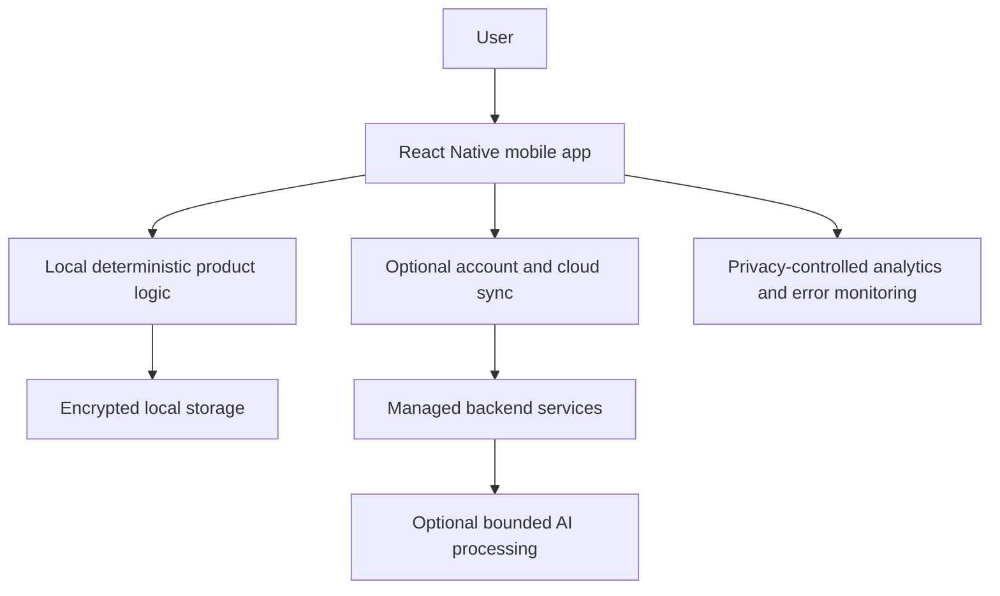

# Relent — Product and Technical Case Study

Relent is a mobile wellbeing product designed to help people notice repeating emotional and behavioural patterns, reflect on what is happening, and choose a practical next action.

This is a documentation-only case study. The production repository, configuration, user data, internal dashboards, and sensitive implementation details remain private.

## Why I built it

I wanted to explore how a product could turn an emotionally ambiguous moment into a structured, understandable flow without presenting itself as therapy, diagnosis, or a crisis service. The product needed to remain useful before account creation and avoid making an AI model the sole decision-maker.

## My role

I have worked across:

- product direction and scope
- user flows and interaction decisions
- implementation using AI-assisted development
- deterministic decision and content-routing logic
- optional cloud and AI integrations
- privacy and safety boundaries
- testing, debugging, and release preparation
- ongoing product iteration

Repository history supports sustained ownership across product, implementation, testing, documentation, and release work. This does not mean I wrote every line without assistance: AI development tools are an important part of my workflow.

## How I built it

I use tools including Claude, Codex, and ChatGPT during research, implementation, debugging, and review. I remain responsible for defining the product behavior, deciding which output is appropriate, checking the implementation against the intended experience, testing failure cases, and deciding what is ready to keep.

The core product experience uses deterministic logic. Optional network capabilities are kept behind explicit boundaries so the main flow does not depend on an AI service being available.

## High-level architecture

The implementation uses React Native, Expo, TypeScript, local encrypted storage, Supabase, optional Anthropic processing, PostHog, Sentry, Jest, and device-flow tooling.

## Interesting decisions

1. **Guest-first rather than account-first.** A user can reach the core experience without first creating a cloud identity.
2. **Deterministic core logic rather than AI-only decisions.** This improves predictability, testability, and the ability to reason about safety boundaries.
3. **Local storage with optional synchronization.** The product remains useful locally while offering account-backed continuity when a user chooses it.
4. **Safety as a gate, not a ranking hint.** Certain states must change which paths are available rather than merely changing a recommendation score.
5. **Explicitly bounded AI use.** AI is used where flexible language can help, while core product behavior retains deterministic fallbacks.

## Challenges

- keeping a growing mobile product understandable as flows and state accumulated
- separating current product behavior from older compatibility paths
- making privacy and security claims match the real implementation
- testing decision logic without assuming that a plausible output is a correct output
- balancing personalization with predictable behavior and safe fallbacks

## What I learned

- Product boundaries become more important as a system gains integrations.
- Deterministic behavior is easier to test, but still needs careful content and edge-case review.
- Privacy language should describe the actual trust boundary, not the intended feeling of the product.
- AI-assisted development still requires ownership of requirements, validation, testing, and release decisions.
- Compatibility and migration work become product concerns once real data and older versions exist.

## Current status

Active development. The private repository identifies the product as a beta; this case study does not claim public adoption, revenue, or user metrics.

## More detail

- [Architecture](docs/architecture.md)
- [Product and technical decisions](docs/decisions.md)
- [Learnings](docs/learnings.md)

## Confidentiality boundary

This repository intentionally excludes production source code, prompts, environment files, credentials, database schemas, internal dashboards, private research materials, operational security details, user data, and unapproved screenshots.
