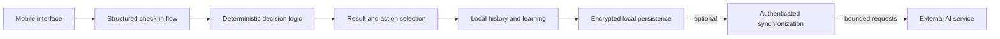

# Architecture

Relent is structured as a local-first mobile product with optional authenticated services.

## Main boundaries

- **Interface:** onboarding, check-ins, results, actions, progress, and account controls.
- **Product logic:** structured inputs are converted into versioned product state and deterministic outputs.
- **Persistence:** product history is stored locally, with encryption applied before it reaches the storage layer.
- **Cloud services:** authentication, optional synchronization, notifications, and bounded server operations.
- **External services:** optional AI processing, analytics, and error monitoring, each with separate controls.

The diagram deliberately omits production identifiers, schemas, endpoints, security configuration, prompts, and internal operational tooling.
